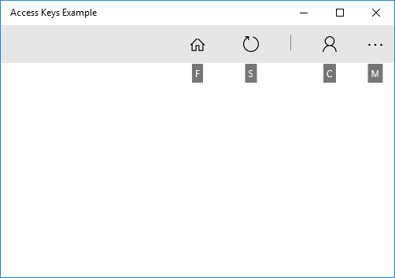
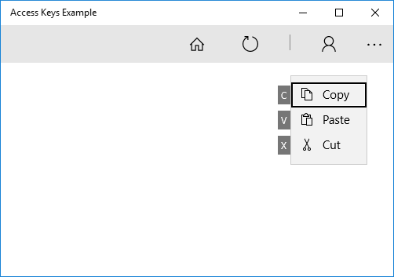

# ACCESSIBILITY

Traditionally, accessibility has been seen as a technology to use at the end of the development process in order to satisfy some small group of users with disabilities or impairments.

In contrast, the new concept of Inclusive design focuses on designing software with everyone in mind from the very beginning. The philosophy is to create better products for everyone from the start, considering the full range of human diversity when developing a service, product or environment. If you want a better insight of the Inclusive Design principles visit the [Inclusive Design at Microsoft](https://www.microsoft.com/en-us/design/inclusive) page.

An inclusive design makes your products, not only accessible for people with permanent disabilities or impairments, but adaptable to the particular circumstances, preferences or environmental situations of every possible user.

Think that when you design your applications for people with permanent disabilities, actually results in apps that benefit people universally. For example, High-contrast screen settings were initially made to benefit people with vision impairments. Today, many people benefit from high-contrast settings when they use a device in bright sunlight. Some users take advantage of assistive technology (AT) because of disabilities or impairments, while others use it out of preference for more comfortable or convenient experience.

An inclusive app usually has several ways for the user to interact with it, shows the information in different ways and has customizations to adequate to the user’s capabilities or preferences. That usually includes:
-	Support for assistive technology (AT) as screen readers or on-screen keyboard for example.
-	An appropriate design of the visual UI, with different alternatives if needed.
-	Support for user customization settings, such as font size, high-contrast, color combinations, etc.

To see a more detailed introduction about designing and developing your accessible application, and about the Inclusive Design, you can follow [this](https://docs.microsoft.com/en-us/windows/uwp/design/accessibility/accessibility) link.

In this chapter we are going to focus in two important elements that can improve greatly your application accessibility: Access Keys and Keyboard Accelerators.

## Access Keys

An access key is a combination of the Alt key and one or more alphanumeric keys (typically pressed sequentially, rather than simultaneously) that improves the usability and the accessibility of your Windows applications, by providing an intuitive way for users to quickly navigate and interact with an app's visible UI, without the need of use any pointer device (such as touch or mouse).

The controls that supports access keys usually displays key tips next to them when you press the Alt Key, showing the alphanumeric keys that activate that control.


To add an access key to a control, use the AccessKey property. The value of this property specifies the access key sequence, the shortcut (if a single alphanumeric), and the Key Tip.

```xml
<Button Content="Play" AccessKey="P" Click="PlayButtonClick" />
```

**Access Key scopes**

When there are many elements in your visual UI that support access keys, it is always recommended that you scope those access keys to minimize the number of Keys Tips shown simultaneously on the screen. This makes them easier to locate and improve their usability.

A typical scenario is to provide two access key scopes: The primary access keys lets the user select which tab he wants to inspect. The secondary access keys lets the user select the specific command the user wants to execute under that tab.

Here, we show how to define an access key scope:

```xml
<CommandBar x:Name="MainCommandBar" AccessKey="M" >
        <AppBarButton AccessKey="F" Icon="Home" Label="Home"/>
        <AppBarButton AccessKey="S" Icon="Refresh" Label="Refresh"/>
        <AppBarSeparator/>
        <AppBarButton AccessKey="C" Icon="Contact" Label="Folder" IsAccessKeyScope="True">
            <AppBarButton.Flyout>
                <MenuFlyout>
                    <MenuFlyoutItem AccessKey="C" Icon="Copy" Text="Copy" />
                    <MenuFlyoutItem AccessKey="V" Icon="Paste" Text="Paste" />
                    <MenuFlyoutItem AccessKey="X" Icon="Cut" Text="Cut" />
                </MenuFlyout>
            </AppBarButton.Flyout>
        </AppBarButton>
</CommandBar>
```

With this configurarion, pressing Alt will show the primary access keys:



Then pressing C will show the secondary access keys:



**Tips to implement Access Keys**

- Avoid Key Access collisions. Access key collisions occur when two or more elements in the same scope have duplicate access keys, or start with the same alphanumeric characters. Avoid collisions by using unique access keys or by scoping commands.
-  Avoid using more than two characters to  minimize keystrokes and support accelerator keys by default (Alt+AccessKey).
- If possible, use the first character of the command name or well-known precedents from other popular apps such as Word, like "F" for File or "H" for Home.

**Localize access keys**

As we described in the chapter Globalization, consider localizing the Access Keys. For example, use for “H” for “Home” in en-US and “I” for “Incio” in es-ES.

As we saw in that chapter, use the x:Uid extension in markup to apply localized resources:

```xml
<Button Content="File" AccessKey="F" x:Uid="FileButton" />
```

And then specify the AccessKey property in the resources.resw file with a FileButton.AccessKey property identifier.

## Keyboard Accelerators

Accelerator keys (or keyboard accelerators) are keyboard shortcuts that improve the usability and accessibility of your Windows applications by providing an intuitive way for users to invoke common actions or commands without navigating the app UI.

Keyboard accelerators make your app more accessible for users with motor disabilities, and more usable for power users who prefer to interact through the keyboard.

Accelerators typically include the function keys F1 through F12 or some combination of a standard key paired with one or more modifier keys (CTRL, Shift).


> **Note:** The UWP platform controls have built-in keyboard accelerators. For example, ListView supports Ctrl+A for selecting all the items in the list, and RichEditBox supports Ctrl+Tab for inserting a Tab in the text box. These built-in keyboard accelerators are referred to as control accelerators and are executed only if the focus is on the element or one of its children. Accelerators defined by you using the keyboard accelerator APIs discussed here are referred to as app accelerators.

Keyboard accelerators can be associated with commands exposed in menus, but they can also be associated with actions that do not have equivalent menu items. Because of that, your app should make easy the discovery of accelerators using labels or established patterns for example.


**Specify a keyboard accelerator**

Use the [KeyboardAccelerator](https://docs.microsoft.com/en-us/uwp/api/windows.ui.xaml.input.keyboardaccelerator) APIs to create keyboard accelerators in UWP apps. With these APIs, you don't have to handle multiple KeyDown events to detect the key combination pressed, and you can localize accelerators in the app resources.

We are going to declare keyboard accelerators for the Copy and Paste commands in the example shown above in the Access Keys section, and a tooltip to show the keyboard accelerator.

```xml
<CommandBar x:Name="MainCommandBar" AccessKey="M" >
    <AppBarButton AccessKey="F" Icon="Home" Label="Home"/>
    <AppBarButton AccessKey="S" Icon="Refresh" Label="Refresh"/>
    <AppBarSeparator/>
    <AppBarButton AccessKey="C" Icon="Contact" Label="Folder" IsAccessKeyScope="True">
        <AppBarButton.Flyout>
            <MenuFlyout>
                <MenuFlyoutItem AccessKey="C" Icon="Copy" Text="Copy" ToolTipService.ToolTip="Copy (Ctrl+C)">
                    <MenuFlyoutItem.KeyboardAccelerators>
                        <KeyboardAccelerator Modifiers="Control" Key="C" />
                    </MenuFlyoutItem.KeyboardAccelerators>
                </MenuFlyoutItem>
                <MenuFlyoutItem AccessKey="V" Icon="Paste" Text="Paste" ToolTipService.ToolTip="Paste (Ctrl+V)">
                    <MenuFlyoutItem.KeyboardAccelerators>
                        <KeyboardAccelerator Modifiers="Control" Key="V" />
                    </MenuFlyoutItem.KeyboardAccelerators>
                </MenuFlyoutItem>
                <MenuFlyoutItem AccessKey="X" Icon="Cut" Text="Cut" />
            </MenuFlyout>
        </AppBarButton.Flyout>
    </AppBarButton>
</CommandBar>
```

The [UIElement](https://docs.microsoft.com/uwp/api/windows.ui.xaml.uielement) object has a [KeyboardAccelerator](https://docs.microsoft.com/uwp/api/windows.ui.xaml.input.keyboardaccelerator) collection, [KeyboardAccelerators](https://docs.microsoft.com/uwp/api/windows.ui.xaml.uielement.KeyboardAccelerators), where you specify your custom KeyboardAccelerator objects and define the keystrokes for the keyboard accelerator:

- **Key:** the [VirtualKey](https://docs.microsoft.com/uwp/api/windows.system.virtualkey) used for the keyboard accelerator.
- **Modifiers:**  the [VirtualKeyModifiers](https://docs.microsoft.com/uwp/api/windows.system.virtualkeymodifiers) used for the keyboard accelerator. If Modifiers is not set, the default value is None.

**Scoped accelerators**

Some accelerators work only in specific scopes while others work app-wide. For example, in Windows File Explorer *CTRL + A* works app-wide, selecting all the files in the current folder, while *CTRL + C*, to copy a file, only works when at least one file is actually selected.

By default, a keyboard accelerator has global scope. You can enable or disable it completely using his [IsEnabled](https://docs.microsoft.com/en-us/uwp/api/windows.ui.xaml.input.keyboardaccelerator.isenabled#Windows_UI_Xaml_Input_KeyboardAccelerator_IsEnabled) property, or you can use the [ScopeOwner](https://docs.microsoft.com/en-us/uwp/api/windows.ui.xaml.input.keyboardaccelerator.scopeowner#Windows_UI_Xaml_Input_KeyboardAccelerator_ScopeOwner) property to specify the scope of the keyboard accelerator.

In the example below, the “CTRL + N” accelerator only works if the focus is on a child of MyGrid:

```xml
<Grid x:Name="MyGrid">
    ...
    <Button Content="New" Click="OnNew">
        <Button.KeyboardAccelerators>
            <KeyboardAccelerator 
                Key="N"
                Modifiers="Control"
                ScopeOwner="{x:Bind MyGrid}" />
        </Button.KeyboardAccelerators>
    </Button>
    ...
</Grid> 
```

**Invoke a keyboard accelerator**

The [KeyboardAccelerator](https://docs.microsoft.com/uwp/api/windows.ui.xaml.input.keyboardaccelerator) object uses the [UI Automation (UIA) control pattern](https://msdn.microsoft.com/library/windows/desktop/ee671194(v=vs.85).aspx) to take action when an accelerator is invoked.

The UIA [control patterns] expose common control functionality. That means that when a keyboard accelerator is used to invoke a control, the XAML framework looks up whether the control implements the [Invoke](https://msdn.microsoft.com/library/windows/desktop/ee671279(v=vs.85).aspx) control pattern and, if so, activates it (it is not necessary to listen for the KeyboardAcceleratorInvoked event).

In the following example, Control+C triggers the Click event of the Button because the button implements the Invoke pattern.

```xml
<Button Content="Copy" Click="OnCopy">
  <Button.KeyboardAccelerators>
    <KeyboardAccelerator Key="C" Modifiers="Control" />
  </Button.KeyboardAccelerators>
</Button>
```
**Advanced Concepts**

You can read more about low-level aspects of keyboard Accelerators in the next link: [Advanced Concepts](https://docs.microsoft.com/en-us/windows/uwp/design/input/keyboard-accelerators#advanced-concepts)
